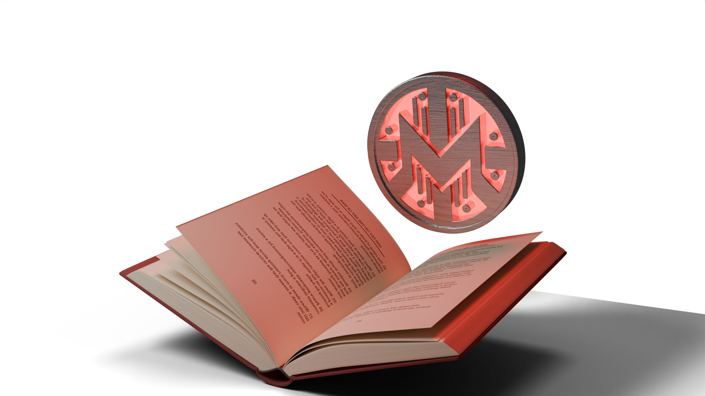
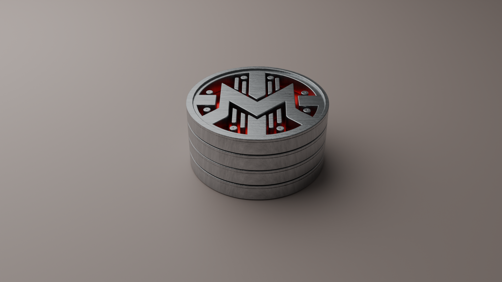
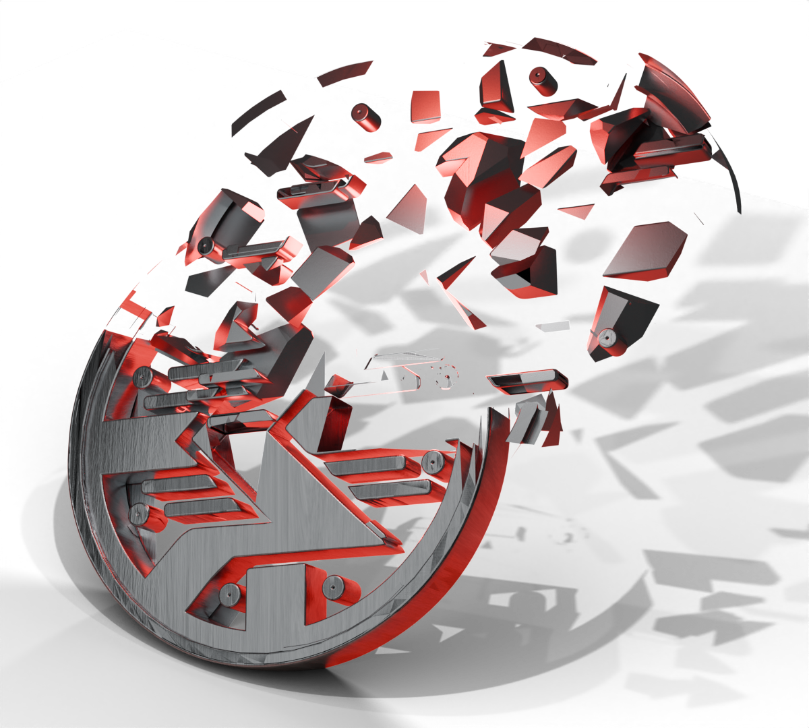
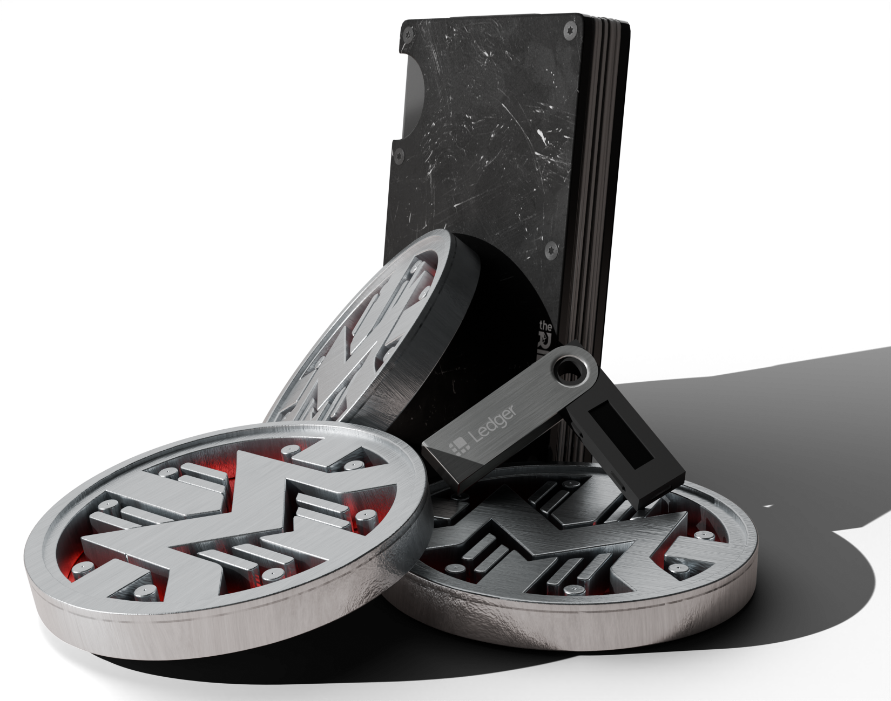

# GetMonero Swiss Redesign Bounty
Take a look around at the files

Enjoy :D 

## Live
- [Figma MockUp](https://www.figma.com/proto/qy0UNWMkLP58N5H6o30qDI/MoneroSwiss?node-id=116-39&t=mx9qeDLy9N9lZgz8-1&scaling=scale-down-width&content-scaling=fixed)

# 3d renders

# Donate
Support My work by donating to any of the following addreses :D

- xmr: `433CbZXrdTBQzESkZReqQp1TKmj7MfUBXbc8FkG1jpVTBFxY9MCk1RXPWSG6CnCbqW7eiMTEGFgbHXj3rx3PxZadPgFD3DX`
- xmr: `4ACPJKijtYsBn1vsYdjS6sLavgvvyEVYg54adcHGYepUMFi8sUttk9obNfaRv3TCMZN5pMeHLiTTpHjAdTkLYPDr33BBRh5`
